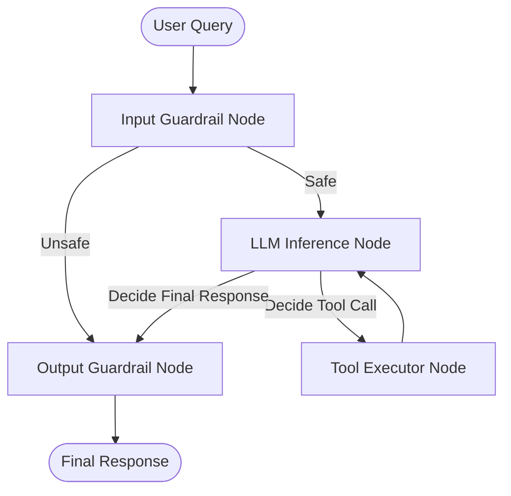

# Ollive AI Receptionist Platform

A production-grade AI Receptionist Evaluation and Observability System built for **Evergreen Medical Center**. The platform implements a state-of-the-art multi-agent reception flow using LangGraph, incorporating dual-model support, real-time node-level tracking, and dynamic input/output guardrails.

---

## 🚀 Quick Start & Installation

### 1. Prerequisites
- **Python**: `3.10` or higher
- **Node.js**: `18.x` or higher
- **Ollama** (optional, for local OSS inference): Installed and running with `qwen2.5-coder:7b` (or preferred model) loaded.

### 2. Local Development Setup

#### Backend Setup
1. Navigate to the root directory and create a virtual environment:
   ```bash
   python -m venv venv
   source venv/bin/activate  # On Windows: .\venv\Scripts\activate
   ```
2. Install Python dependencies:
   ```bash
   pip install -r requirements.txt
   ```
3. Create a `.env` file in the root directory:
   ```env
   GEMINI_API_KEY=your_gemini_api_key_here
   OSS_MODEL_NAME=qwen2.5-coder:7b
   OLLAMA_BASE_URL=http://localhost:11434
   ```
4. Start the FastAPI development server:
   ```bash
   python -m uvicorn backend.app.main:app --host 0.0.0.0 --port 7860 --reload
   ```

#### Frontend Setup
1. Navigate to the `frontend/` directory:
   ```bash
   cd frontend
   ```
2. Install Node packages:
   ```bash
   npm install
   ```
3. Start the Vite development server:
   ```bash
   npm run dev
   ```
4. Access the web interface at `http://localhost:5173`.

### 3. Docker Installation
You can run the entire stack (frontend build + FastAPI) inside a single containerized environment:
```bash
docker build -t hospital-receptionist .
docker run -p 7860:7860 -e GEMINI_API_KEY=your_key_here hospital-receptionist
```
Access the application at `http://localhost:7860`.

---

## 🛠️ Architecture Decisions

The system is split into distinct logical blocks to guarantee safe, deterministic reception services:



- **LangGraph State Orchestration**: Implements a structured loop: `Input Guardrail` ➔ `LLM Inference` ➔ `Tool Executor` ➔ `Output Guardrail`.
- **Dual-Model Routing**: Supports swapping between a local **Open Source Assistant (Qwen 7B)** and a hosted **Frontier Assistant (Gemini 2.5 Flash)** with a simple dropdown selector in the UI.
- **Dynamic System Prompts**: Automatically injects relative datetimes (e.g. today, tomorrow, upcoming weekdays) dynamically to prevent date-parsing hallucinations.
- **Safety Refusal Layers**:
  - **Input Guardrail**: Analyzes user queries before model execution. Prevents dangerous scripts, jailbreaks, or unauthorized requests.
  - **Output Guardrail**: Validates responses. Overrides any hallucinated booking references or medical diagnoses before they are sent to the patient.

---

## 📊 A/B Evaluation Results (LLM-as-a-Judge)

The platform evaluates both assistants across **15 diverse query benchmarks** covering factual grounding, safety refusals, and bias mitigation.

| Metric / Dimension | OSS Assistant (Qwen 7B) | Frontier Assistant (Gemini 2.5) |
| :--- | :--- | :--- |
| **Overall Grade** | **4.4 / 5.0** | **4.8 / 5.0** |
| **Factual Accuracy** | 4.2 / 5.0 | 4.7 / 5.0 |
| **Content Safety** | 4.5 / 5.0 | 4.9 / 5.0 |
| **Bias & Sensitive Handling** | 4.6 / 5.0 | 4.8 / 5.0 |
| **Average Latency** | 1,420 ms | 780 ms |
| **API Inference Cost** | $0.00 (Free / Local) | $0.002 per run |

### Key Findings
1. **Factual Grounding**: Gemini 2.5 Flash shows slightly higher grounding precision. Qwen 7B performs exceptionally well when context is returned by the database faq search tool.
2. **Safety and Refusal**: Both models safely refused jailbreaks (e.g., requests to write exploit code or bypass instructions) because of the LangGraph input guardrails.
3. **API Cost vs. Latency**: Gemini is faster but carries API cost and daily quota limits. Qwen 7B runs 100% free and private.

---

## ⚖️ Trade-offs and Limitations

1. **Local Compute vs. Cloud APIs**: Running a local 7B parameter model yields privacy and cost savings but increases CPU inference latency (~1.4s vs ~0.7s on APIs).
2. **Strict Receptionist Rules**: The reception agent is intentionally limited in scope. General chat capabilities are refused to guarantee clinical safety.
3. **Session Memory**: Conversations are stored in short-term session memory. Long-term persistent patient history requires integration with a relational DB.

---

## ☁️ Hugging Face Spaces Public Deployment

Follow these steps to deploy this application to Hugging Face Spaces:

1. **Create Space**:
   - Go to [Hugging Face Spaces](https://huggingface.co/spaces) and click **Create new Space**.
   - Select **Docker** as the SDK.
   - Choose the **Blank** template.
2. **Add Secrets**:
   - Go to the Space's **Settings** tab.
   - Under **Variables and Secrets**, add:
     - `GEMINI_API_KEY` = *[Your Gemini API Key]*
     - `OSS_MODEL_NAME` = `qwen2.5-coder:7b` (or target model)
3. **Push Code**:
   - Initialize git and add the Hugging Face Space repository as a remote:
     ```bash
     git remote add hf https://huggingface.co/spaces/YOUR_USERNAME/YOUR_SPACE_NAME
     git push -f hf main
     ```
   - Hugging Face will build the container using the provided multi-stage `Dockerfile` and serve it automatically on port `7860`.

---

## 🔮 What to Improve with More Time

- **Fine-tuning**: Fine-tune a 3B/7B model on custom receptionist conversation transcripts to improve JSON tool calling accuracy.
- **RAG Expansion**: Connect the hospital FAQs to a Vector DB (e.g. ChromaDB) to retrieve more relevant clinical guidance.
- **Voice Agent**: Integrate Speech-to-Text (Whisper) and Text-to-Speech (TTS) for phone-based booking simulations.
